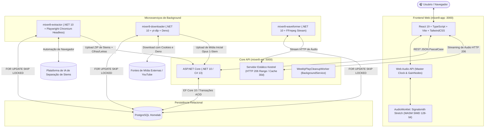

# 🎧 O que é o Mixer8? Guia Completo do Ecossistema, Arquitetura e Padrões de Desenvolvimento

> 🎙️ **Áudio Explicativo Complementar:** Este documento possui uma gravação explicativa correspondente em áudio disponível em [`docs/O que é o Mixer 8.mp3`](file:///g:/DEV/mixer8/docs/O%20que%20%C3%A9%20o%20Mixer%208.mp3).

---

## 1. Visão Geral e Conceito Inovador

O **Mixer8** é uma plataforma que une a experiência fluida e moderna de streaming musical estilo plataformas de referência (como o Spotify) com as capacidades de engenharia de áudio e manipulação multicanal de uma **Digital Audio Workstation (DAW)** web completa.

### A Inovação Conceitual: A Música Como Matriz de Stems
Em plataformas de áudio tradicionais, uma faixa é consumida como um arquivo de áudio estático fechado (normalmente um arquivo `.mp3` ou estéreo único). No **Mixer8**, o conceito de música é expandido:

> **Uma música é a fusão harmônica, síncrona e em tempo real de até 10 faixas independentes (stems)**:

```
[Streaming Convencional] ──> Único arquivo estático (estéreo fechado)

[Mixer8 Ecossistema]    ──> Matriz Dinâmica de Stems Síncronas:
                            ├── 1. Voz (Vocals - canal principal e backing vocals)
                            ├── 2. Bateria (Drums - percussão acústica e eletrônica)
                            ├── 3. Baixo (Bass - contrabaixo elétrico, acústico ou sintetizado)
                            ├── 4. Guitarra (Guitars - guitarras e violões)
                            ├── 5. Piano (Piano - pianos acústicos e elétricos)
                            ├── 6. Teclado (Keyboards - sintetizadores, pads e órgãos)
                            ├── 7. Sopro (Wind - metais, saxofones e flautas)
                            ├── 8. Cordas (Strings - violinos, cellos e orquestrações)
                            ├── 9. Metrônomo (Metronome - clique guia sincronizado)
                            └── 10. Outros (Other - efeitos e ambiências residuais)
```

O ouvinte deixa de ser um consumidor passivo e passa a ser o operador da mesa de som:
* Ajusta **faders de volume individuais** por instrumento;
* Ativa **Solo** ou **Mute** em qualquer stem para estudo ou isolamento de partes musicais;
* Realiza **Pitch Shifting** ($\pm 12$ semitons) sem alterar a velocidade da faixa;
* Modifica o **Andamento / BPM** ($-50\%$ a $+100\%$) sem alterar a afinação original;
* Acompanha **cifras e letras sincronizadas** em tempo real com seek interativo por clique;
* Visualiza **formas de onda (waveforms)** individuais renderizadas por canal;
* Cria e salva **Presets de Mixagem** customizados para compartilhar com outros usuários;
* Realiza a **Exportação da Mixagem** direta no navegador em MP3 192kbps 48kHz via processamento DSP em WebAssembly.

---

## 2. Arquitetura Geral do Ecossistema

O repositório é concebido como uma arquitetura distribuída e desacoplada, composta por cinco serviços orquestrados via Docker Compose:



### Módulos do Sistema

1. **[`mixer8-app`](file:///g:/DEV/mixer8/mixer8-app)**: SPA em React 19, TypeScript e TailwindCSS. Possui layout persistente com player headless no rodapé que nunca interrompe a reprodução entre navegações de tela, mesa DAW com rotary knobs, canvas de waveforms, viewer de cifras/letras e motor DSP WebAssembly.
2. **[`mixer8-api`](file:///g:/DEV/mixer8/mixer8-api)**: API RESTful em .NET 10 / C# 13. Centraliza autenticação JWT, controle de acesso RBAC, regras de playlists, descompactação segura de arquivos ZIP (anti-Zip Slip e anti-Zip Bomb) e transações no banco de dados.
3. **[`mixer8-extractor`](file:///g:/DEV/mixer8/mixer8-extractor)**: Bot autônomo em C# que executa o navegador Chromium oficial (canal `chrome`) via Playwright com `shm_size: '2gb'` para suportar o carregamento da DAW da IA parceira. Ele baixa o ZIP das stems com fallback direto em `HttpClient`, intercepta eventos de rede para extrair `chords.json` e `lyrics.json` e envia tudo estruturado para a API.
4. **[`mixer8-downloader`](file:///g:/DEV/mixer8/mixer8-downloader)**: Microsserviço worker baseado em `yt-dlp` acoplado a um runtime estático do **Deno** e à biblioteca `yt-dlp-ejs` para resolver assinaturas dinâmicas do YouTube (*n-challenge*). Suporta arquivos de cookies Netscape para contornar bloqueios de IP em servidores de nuvem (VPS).
5. **[`mixer8-waveformer`](file:///g:/DEV/mixer8/mixer8-waveformer)**: Worker que consome os fluxos de áudio da API via streaming em memória (*Zero-Disk*) acoplado aos pipes de entrada do FFmpeg, gerando o array numérico de picos de onda para alimentar os canvas gráficos da DAW.

---

## 3. O Quão Data-Driven é o Mixer8?

O Mixer8 é **moderadamente orientado a dados (Data-Driven)**, com uma distribuição estimada em **65% Data-Driven e 35% Code-Driven**.

### O que é 100% Data-Driven (Modifica-se por Dados, sem Alterar Código)
* **DAW e Faders Multicanal:** O número de faders exibidos na mesa de mixagem é estritamente derivado da relação de stems registradas no banco (`Track.Stems`). Se uma música possuir 2 stems, a interface abre 2 faders. Se possuir 10 stems, abre 10. Se for 1-stem (`Completo`), toca como canal estéreo padrão.
* **Nomenclatura de Canais:** O campo `StemType` é livre na tabela relacional. Canais novos com nomes não mapeados recebem automaticamente um fallback de abreviação (`name.slice(0, 3).toUpperCase()`).
* **Cifras, Compassos e Letras:** O visualizador consome os arquivos estáticos `chords.json` e `lyrics.json` salvos na pasta da música. Alterar acordes, compassos ou letras exige apenas sobrescrever o arquivo JSON.
* **Formas de Onda (Waveforms):** Os picos de amplitude são salvos como JSON numérico na tabela `StemWaveforms`. Alterações ou novas gerações no banco refletem diretamente na interface gráfica.
* **Configurações Globais (`SystemSettings`):** Chaves dinâmicas chave-valor no PostgreSQL, editáveis em tempo de execução via painel administrativo (ex: `PremiumFeature_DownloadOffline`, `AccessWebhookUrl`).
* **Ambiente e Resiliência via `.env`:** Portas (`API_PORT`, `WEB_PORT`), domínios de CORS, timeouts de espera do bot (`EXTRACTOR_WAIT_TIME_BASE_SECONDS`), argumentos extras do yt-dlp e cookies do YouTube operam de forma desacoplada do código compilado.

### O que é Code-Driven (Exige Alteração e Compilação de Código)
* **Papéis de Usuário (RBAC):** Os papéis são governados pelo enum em C# `UserRoleType` (`Admin`, `Moderator`, `PaidUser`, `User`) e validados por atributos `[Authorize(Roles = "...")]`. Adicionar novos papéis requer alterar código no backend e tipagens no frontend.
* **Regras de Negócio e Audiência:** A regra dos 30 segundos (ou 50%) de escuta acumulada está codificada no hook de reprodução (`PlayerContext.tsx`), o cooldown anti-spam está compilado em `TracksController.cs` e o ciclo de 1h para limpeza semanal está no `WeeklyPlayCleanupWorker.cs`.
* **Automação Headless do Extrator:** Os seletores de botões, tags de frames e fluxos do Playwright estão acoplados ao DOM da plataforma de IA de terceiros.
* **Processador DSP (WebAssembly):** O motor Signalsmith Stretch está compilado em `.wasm`. Alterar limites de semitons ou buffers exige compilação C++ com Emscripten.
* **Design System e Layout:** A identidade visual e paleta de cores estão codificadas em classes utilitárias do TailwindCSS e componentes React.

---

## 4. Padrões de Desenvolvimento e Engenharia (As Skills do Projeto)

Todo o ecossistema Mixer8 é governado por diretrizes técnicas rigorosas documentadas nos protocolos da pasta `.agents/skills`:

### 4.1. Soberania do Backend & Contratos PascalCase ([`react-spa-pascalcase-best-practices`](file:///c:/Users/Havenox/.agents/skills/react-spa-pascalcase-best-practices/SKILL.md) & [`dotnet10-backend-best-pratices`](file:///c:/Users/Havenox/.agents/skills/dotnet10-backend-best-pratices/SKILL.md))
* **A Regra de Ouro:** O backend é soberano e determina os contratos de dados de ponta a ponta. Todas as chaves de objetos JSON de entrada e saída (Request/Response) da API trafegam estritamente em **PascalCase**.
* No .NET 10, a serialização é configurada com `options.JsonSerializerOptions.PropertyNamingPolicy = null;`, impedindo a conversão para camelCase.
* No TypeScript / React, todas as interfaces espelham exatamente os mesmos nomes ditados pelo servidor (`TrackId`, `TrackTitle`, `Stems`, `AudioUrl`, `ExtractionStatus`), eliminando conversores manuais no cliente.

### 4.2. Padrões de Engenharia de Backend ([`dotnet10-backend-best-pratices`](file:///c:/Users/Havenox/.agents/skills/dotnet10-backend-best-pratices/SKILL.md))
* **Primary Constructors:** Uso obrigatório da sintaxe de construtores primários do C# 13 para injeção de dependências limpa em controllers, serviços e workers:
  ```csharp
  public class TracksController(Mixer8DbContext dbContext, ILogger<TracksController> logger) : ControllerBase
  ```
* **Assincronismo Total:** Todas as rotinas com I/O de banco de dados, disco ou rede devem ser assíncronas (`async`/`await`), retornando `Task` ou `Task<T>`.
* **Atomicidade ACID e Isolamento:** Operações de mutação de mídias e extração executam em blocos transacionais explícitos. Falhas em qualquer stem acionam `RollbackAsync` imediato.
* **Concorrência Sem Bloqueio:** Filas de background no PostgreSQL utilizam `FOR UPDATE SKIP LOCKED`, garantindo que múltiplos containers operem simultaneamente sem contenção de registros.
* **Isolamento de Entidades e Prevenção de Over-Posting:** Entidades reais de banco nunca são expostas cruas em endpoints de mutação; utiliza-se DTOs estritos de entrada e saída.

### 4.3. Padrões de Engenharia de Frontend ([`react-spa-pascalcase-best-practices`](file:///c:/Users/Havenox/.agents/skills/react-spa-pascalcase-best-practices/SKILL.md))
* **Estado Derivado (Derived State):** Proibido o uso de `useEffect` para sincronizar estados redundantes. Lógicas de ordenação, filtros ou paginação devem ser calculadas diretamente no corpo do componente durante a renderização.
* **Defesa Contra Concorrência e Duplo Submit:** Botões de envio e ações assíncronas devem ser fisicamente desabilitados (`disabled={isPending}`) durante o processamento.
* **Zero Mocks:** Proibido o uso de dados fictícios hardcodados. Telas vazias devem renderizar *empty states* elegantes que orientem o usuário.
* **Estabilidade Referencial:** Handlers de áudio contínuo e acumuladores de tempo utilizam `useRef` para evitar congelamento por *stale closures*.

### 4.4. Design Visual e Rigor Estético ([`frontend-design`](file:///c:/Users/Havenox/.agents/skills/frontend-design/SKILL.md))
* **Ambiente Ultra-Dark:** Interface concebida exclusivamente para o ambiente noturno profissional.
  * Sidebar: `#000000` (Preto Absoluto)
  * Fundo da Aplicação e Player: `#121212` (Grafite Escuro)
  * Cards e Superfícies: `#1A1A1A` ou `#1E1E1E`
  * Destaques e Acentos: `#1DB954` (Verde Estúdio de Alta Fidelidade)
* **Repúdio a Clichês de IA:** Proibidos gradientes multicoloridos difusos (como roxo com azul elétrico) e sombras flutuantes exageradas.
* **Bordas Finas e Geometria:** Acentuação com bordas de 1px de baixo contraste (`border-brand-hover/80`), cantos sutis (2px a 6px) e organização cirúrgica de dados técnicos.
* **Tipografia:** Uso das fontes `Montserrat` para títulos de grande autoridade e `Inter` para leituras, controles de DAW e metadados.

### 4.5. Protocolo de Estudos de Caso ([`case-study`](file:///c:/Users/Havenox/.agents/skills/case-study/SKILL.md))
* Todas as refatorações arquiteturais, adições de features e correções críticas são documentadas cronologicamente na pasta `docs/implementations/` com numeração de três dígitos (`NNN-slug-do-tema.md`).
* O formato segue um padrão estrito de 5 seções em português (pt-BR):
  1. **Desafio de Engenharia** (dor ou problema enfrentado);
  2. **Estratégia da Solução** (decisão arquitetural);
  3. **Implementação Técnica** (classes e arquivos alterados);
  4. **Impacto e Resultado**;
  5. **Nota do Desenvolvedor** (reflexão técnica sobre o aprendizado).

### 4.6. Preservação de Contexto ([`context-preservation-documentator`](file:///c:/Users/Havenox/.agents/skills/context-preservation-documentator/SKILL.md))
* O ecossistema mantém um documento unificado de "Save State" em [`docs/context-preservation.md`](file:///g:/DEV/mixer8/docs/context-preservation.md).
* A cada milestone concluído, os novos recursos, decisões e lições operacionais são incorporados para garantir que novos desenvolvedores e sessões de IA compreendam o *porquê* de cada decisão tomada.

### 4.7. Versionamento por Commits Atômicos ([`atomic-git-commits`](file:///c:/Users/Havenox/.agents/skills/atomic-git-commits/SKILL.md))
* **Zero Código Quebrado:** Nenhum commit pode conter código que falhe na compilação (`dotnet build`, `npm run build`).
* **Segregação Estrita de Escopo:** É proibido misturar Backend, Frontend e Infraestrutura no mesmo commit.
* **Conventional Commits em pt-BR:** As mensagens de commit seguem títulos claros no imperativo e corpos explicativos detalhados com as seções `Contexto/Problemas resolvidos`, `Solução` e `Impacto / Arquivos modificados`.

---

## 5. Como Desenvolver e Rodar a Aplicação

### Pré-requisitos
* **Docker** & **Docker Compose** instalados no ambiente.
* Instância do **PostgreSQL** acessível (localmente ou via rede/homelab).
* **.NET 10 SDK** (para desenvolvimento local do backend).
* **Node.js LTS** (para desenvolvimento local do frontend).

### Passo a Passo de Execução

1. **Configuração de Variáveis de Ambiente:**
   Copie o arquivo de exemplo para a raiz do repositório:
   ```bash
   cp .env.example .env
   ```
   *Edite os campos de conexão do banco de dados (`DB_HOST`, `DB_PORT`, `DB_NAME`, `DB_USER`, `DB_PASSWORD`), chaves JWT e portas desejadas.*

2. **Inicialização Completa via Docker Compose:**
   ```bash
   docker compose up -d --build
   ```

3. **Portas e Serviços Ativos:**
   * **Frontend (`mixer8-app`)**: `http://localhost:3000`
   * **API Core (`mixer8-api`)**: `http://localhost:5000` (documentação Swagger OpenAPI disponível em modo Development)
   * **Extrator de Stems (`mixer8-extractor`)**: `http://localhost:5010`
   * **Downloader (`mixer8-downloader`)**: Worker em background integrado à rede Docker
   * **Waveformer (`mixer8-waveformer`)**: Worker em background integrado à rede Docker

---

## 6. Conclusão

O **Mixer8** representa um ecossistema com alto padrão de engenharia de software e áudio digital. Sua arquitetura equilibra o processamento intensivo de mídias (isolado em workers especializados) com a reatividade do frontend e a segurança relacional do backend. 

Seguindo os padrões das skills documentadas, qualquer modificação no repositório deve respeitar a **soberania do backend em PascalCase**, a **resiliência transacional ACID**, a **documentação contínua de estudos de caso** e o **versionamento em commits atômicos estruturados**.
