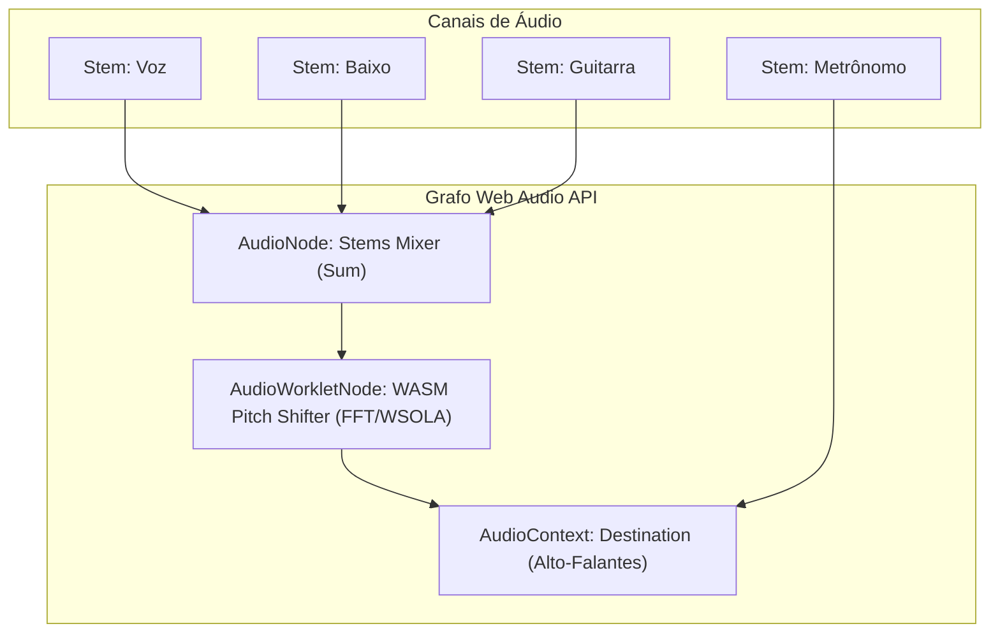

Como engenheiro sênior de áudio digital e arquiteto de sistemas, proponho uma solução de **Processamento de Sinal Digital (DSP)** de alta fidelidade e baixa latência para o **Mixer8**. 

Para transpor o áudio em tempo real sem alterar o andamento (Pitch Shifting) e sem introduzir os indesejados artefatos metálicos ou eco (phasing), a execução em **WebAssembly (WASM)** rodando dentro de um **AudioWorklet** (Web Audio API) é, de fato, a melhor arquitetura do mercado.

Abaixo, detalho a proposta de arquitetura para este motor de transposição.

---

# Proposta de Arquitetura: Motor de Transposição de Áudio em WebAssembly (WASM)

## 1. O Desafio do Pitch Shifting de Alta Qualidade no Navegador
Transpor o áudio (mudar a frequência fundamental) sem alterar a velocidade de reprodução exige algoritmos de domínio de tempo ou frequência complexos:
*   **WSOLA (Waveform Similarity Overlap-Add):** Excelente para transposição baseada no domínio do tempo, preserva os transientes (como batidas de bateria) e consome menos processamento.
*   **Phase Vocoder com Travamento de Fase (Phase Locking):** Analisa o áudio no domínio da frequência (via FFT/IFFT). Oferece altíssima qualidade harmônica, ideal para vocais e instrumentos de corda, mas exige alta performance matemática.

Executar esses cálculos diretamente em Javascript na Main Thread geraria gargalos de renderização na interface e *glitches* (estalos) no áudio. A solução definitiva é compilar o motor DSP escrito em **Rust** ou **C++** para **WASM** e executá-lo em uma thread dedicada de áudio (**AudioWorklet**).

---

## 2. Desenho de Arquitetura do Grafo de Áudio (Otimização E2E)
O **Mixer8** trabalha com multi-stems (até 10 faixas simultâneas). Transpor 10 faixas individualmente em WASM consumiria recursos de hardware excessivos, inviabilizando o uso em celulares (onde o processamento WASM é limitado). 

Proponho uma abordagem otimizada de **Master Pitch Shifter**:

### Detalhes do Fluxo:
1.  **Stems Mixer:** Todas as stems harmônicas (Voz, Baixo, Teclados, etc.) são somadas em um único nó de ganho (Mixer).
2.  **Bypass do Metrônomo:** A stem do **Metrônomo** (se ativa) ignora o Pitch Shifter e vai direto para a saída (`Destination`). Transpor o clique do metrônomo degradaria o som do bloco de madeira/click desnecessariamente.
3.  **Processamento Único:** Apenas o sinal mixado passa pelo nó do **WASM Pitch Shifter**, reduzindo a carga de CPU de 10 motores para apenas **1 motor de transposição**.

---

## 3. Componentes do Motor WASM

### A. O DSP Core (Rust/C++)
Podemos adotar duas abordagens open-source de padrão profissional para o Core do WASM:
*   **Abordagem C++ (SoundTouch Library):** A biblioteca *SoundTouch* é amplamente utilizada no mercado de áudio para pitch shifting de alta fidelidade e possui suporte consolidado a compilação cruzada para WASM via `emscripten`. Ela possui rotinas otimizadas para domínio do tempo.
*   **Abordagem Rust (SoundTouch Rust ou DSP customizado):** Compilado via `wasm-pack` e `wasm-bindgen`. Rust oferece controle estrito de alocação de memória (fundamental para evitar *Garbage Collection* na thread de áudio).

### B. A Thread de Áudio (AudioWorklet)
*   **`pitch-shift-processor.js`**: O processador que roda na thread de áudio do navegador em tempo real.
*   Ele recebe os blocos de áudio de entrada (128 amostras a 48kHz), alimenta o buffer circular do motor WASM, processa o Pitch Shifter e retorna o buffer de saída.
*   **Comunicação sem travamentos (Zero Message Overhead):** Os parâmetros de transposição (ex: semitons de `-6` a `+6`) são passados via `AudioParam` do Web Audio, permitindo transposição imediata e suave.

---

## 4. Fluxo de Execução da Transposição no Cliente

1.  **Inicialização:**
    *   Ao carregar o `PlayerContext`, o arquivo `.wasm` é carregado e compilado em cache.
    *   O processador do `AudioWorklet` é registrado no `AudioContext`.
2.  **Transposição Clicada (Interface):**
    *   Ao clicar no botão `+` ou `-` de Tom no modal de Letras & Cifras, a interface atualiza o estado local das cifras e envia uma mensagem para o nó de áudio:
        `pitchShifterNode.parameters.get('semitones').setValueAtTime(novoTom, audioContext.currentTime);`
3.  **Processamento WASM:**
    *   O motor WASM recebe a instrução e altera o fator de escala harmônica do algoritmo (WSOLA ou Vocoder) em tempo real, sem gerar silêncio, glissandos esquisitos ou cliques.

---

## 5. Viabilidade Técnica e Próximos Passos
Esta é uma solução extremamente viável e moderna, que colocaria o **Mixer8** no mesmo patamar tecnológico de plataformas como o Moises e DAWs web profissionais (como o BandLab). 

Caso deseje prosseguir em um momento futuro, os passos para implementação serão:
1.  Estruturar o subprojeto Rust/C++ compilando o algoritmo de Pitch Shifting para um módulo `.wasm` isolado.
2.  Criar o arquivo `PitchShiftProcessor.ts` para carregar o WASM no pipeline do `AudioWorklet`.
3.  Integrar o nó no pipeline de mixagem do `PlayerContext.tsx`.

O que você acha dessa arquitetura baseada no **Master Pitch Shifter** no `AudioWorklet`?