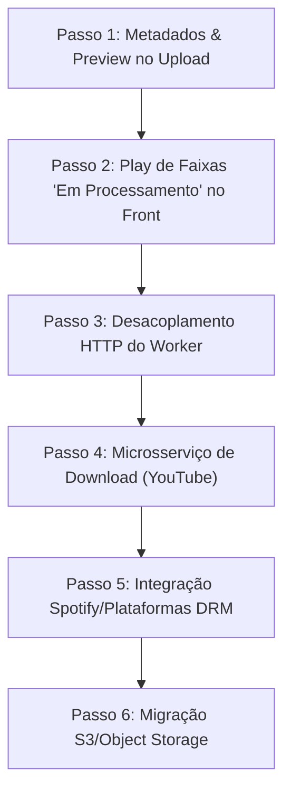

# Proposta de Evolução da Arquitetura — Mixer8 Ecosystem

Este documento descreve a proposta de evolução arquitetural do ecossistema Mixer8. O objetivo é aprimorar a experiência do usuário através da disponibilização imediata de músicas carregadas (preview de canal único), descentralizar o download de mídias através de um novo microsserviço agnóstico de download, possibilitar o suporte a múltiplas plataformas de streaming (mesmo aquelas protegidas por criptografia DRM) e permitir o dimensionamento horizontal da infraestrutura com desacoplamento total de discos locais através de Object Storage compatível com a API do Amazon S3.

---

## 📌 Contexto e Objetivos

O Mixer8 necessita dar um salto de maturidade técnica e de usabilidade:
1. **Redução do Tempo de Espera percebido (UX)**: Atualmente, o upload para extração de stems deixa a música indisponível até que o bot Playwright faça todo o ciclo na plataforma de IA externa, gerando esperas de 3 a 5 minutos sem feedback auditivo. A evolução visa disponibilizar a faixa para reprodução em tempo de upload.
2. **Centralização de Downloads**: Desacoplar a extração de stems da rotina de download. O downloader deve ser um microsserviço independente capaz de expandir para futuras fontes de mídias.
3. **Escalabilidade Distribuída**: Permitir que o backend da API e o worker do Playwright rodem em servidores físicos distintos e escalem horizontalmente sem depender de volumes compartilhados em disco ou NFS, transitando a infraestrutura para o modelo *Stateless*.

---

## 🚀 1. Microsserviço de Download Agnóstico (`mixer8-downloader`)

Será introduzido um novo módulo ao ecossistema, o `mixer8-downloader`, que centralizará as rotinas de download de mídias externas.

### Funcionalidade Geral
* A API principal registra o link enviado pelo usuário e delega a tarefa de download ao `mixer8-downloader` via banco de dados ou mensageria leve.
* O downloader realiza a captura da stream, executa o FFmpeg localmente se necessário para padronizar o container de áudio e devolve o arquivo para a API.

### Suporte a Plataformas com DRM (Spotify, Deezer, Apple Music, etc.)
Para viabilizar o download a partir de serviços de assinatura restritos sem violar chaves de criptografia Widevine/FairPlay ou expor contas premium dos servidores:
1. **Casamento de Metadados (Metadata Matching)**: Ao receber uma URL do Spotify, por exemplo, o downloader faz requisições simples e públicas para a API da respectiva plataforma para coletar os metadados ricos da faixa: Título, Artista, Álbum, Capa (HD), Ano, Gênero e o código **ISRC** (International Standard Recording Code).
2. **Busca e Captura Resiliente**: Usando os metadados ricos (especialmente o código ISRC), o downloader realiza uma busca no catálogo do YouTube Music / YouTube para localizar o áudio correspondente sem criptografia.
3. **Injeção de Tags**: O áudio correspondente é baixado do YouTube, convertido para a especificação de reprodução do app e gravado com as tags de metadados originais coletadas do Spotify.

---

## 🧠 2. Overhaul do Fluxo de Upload e Prévia Imediata (1-Stem)

Este avanço elimina a espera passiva do usuário, permitindo ouvir a música de forma instantânea enquanto o processo de separação de stems ocorre em segundo plano.

### Etapa 1: Upload e Conversão Imediata (API)
* Ao enviar um arquivo de mídia física (áudio ou vídeo) ou ao receber o download concluído pelo `mixer8-downloader`:
  1. A API principal utiliza um extrator de metadados nativo ou CLI (`TagLibSharp` ou `ffprobe`) para ler as informações de tags embutidas e a imagem de capa física do arquivo de mídia.
  2. Converte instantaneamente o arquivo em memória para Opus Estéreo leve de alta fidelidade e salva o arquivo resultante no diretório `/wwwroot/stems/{trackId}/Completo.opus`.
  3. Adiciona o registro da `Track` com status `ExtractionStatus = "Processando"` e cria uma única `Stem` temporária associada a ela (`StemType = "Completo"`).
  4. O banco de dados é atualizado e o endpoint responde imediatamente ao frontend.

### Etapa 2: Experiência Visual e Execução no Frontend
* O frontend atualiza a listagem de músicas do usuário reativamente.
* A música torna-se **disponível para reprodução** de forma imediata na SPA, tocando o arquivo `Completo.opus` como uma faixa comum de 1-stem.
* Um indicador visual discreto e animado (ex: "Separando Stems em Background...") é renderizado na linha da música, mantendo os faders do mixer ocultos/desabilitados apenas para esta faixa específica.

### Etapa 3: Integração HTTP no Worker (Playwright)
* Para permitir que o `mixer8-extractor` (bot) rode em um servidor isolado, ele deixará de depender de caminhos físicos compartilhados para o arquivo de entrada:
  1. O bot consulta a tarefa pendente no banco e faz um download HTTP simples do arquivo `/stems/{trackId}/Completo.opus` a partir da API.
  2. Executa a rotina de automação no navegador headless (Playwright) enviando o arquivo para a plataforma de IA.
  3. Ao baixar as stems separadas, o worker envia o arquivo ZIP resultante de volta à API principal através de um **POST HTTP Multipart (form-data)**, tornando o worker totalmente independente de compartilhamento de pastas físicas.

### Etapa 4: Substituição Atômica no Backend
* Ao receber o payload do ZIP de stems, a API principal executa uma transição de banco de dados ACID:
  1. Exclui o registro da stem temporária `"Completo"` e apaga o arquivo `Completo.opus` física e permanentemente do disco.
  2. Extrai, converte para Opus e salva as stems reais (`Voz.opus`, `Bateria.opus`, etc.).
  3. Adiciona as novas stems à tabela `Stems` vinculadas à música.
  4. Atualiza o status `ExtractionStatus` para `"Pronto"`.
* O frontend atualiza reativamente, removendo o indicador de processamento e liberando instantaneamente a mesa de mixagem DAW com todos os faders ativos.

---

## ☁️ 3. Desacoplamento de Storage (Compatibilidade S3)

Para permitir escalabilidade horizontal e eliminar o consumo de disco local nos servidores de aplicação (API e Worker), toda a persistência de mídias será abstraída para um **Object Storage** compatível com a API S3 (como **MinIO** em ambiente de homologação/homelab, ou **Cloudflare R2** / **AWS S3** / **Backblaze B2** em produção).

* **API e Worker Stateless**: Nenhum dos containers precisará de volumes persistentes grandes. O armazenamento local de processamento passa a ser estritamente temporário e efêmero.
* **Leitura Direta via CDN**: O player do frontend apontará as tags de áudio e imagem diretamente para as URLs públicas ou pré-assinadas do Bucket S3 protegidos por CDN (ex: Cloudflare), economizando banda do servidor da API principal.
* **Upload Direto via Backend**: Toda transcodificação e geração final de arquivos `.opus` é feita em memória pela API, que se encarrega de enviar os streams diretamente ao Object Storage via SDK de integração S3.

---

## 🛠️ Plano de Implementação Seamless (Passo a Passo)

Para garantir que a aplicação continue 100% funcional em produção durante a migração, o desenvolvimento será focado em etapas modulares, sem causar interrupções de serviço.

### Passo 1: Extração de Metadados e Geração de Prévia no Upload
* **Foco**: Apenas Backend/API.
* **Alteração**: Mudar o endpoint `/api/Tracks/Upload` para ler metadados com `TagLibSharp` ou `ffprobe`, salvar o arquivo Opus na pasta de stems com o nome `Completo.opus`, e criar a associação na tabela de `Stems` no banco com status `Aguardando` ou `Processando`. A API também gera a cópia temporária no diretório de downloads para manter compatibilidade com o worker atual.

### Passo 2: Habilitação de Play de Faixas "Em Processamento" no Frontend
* **Foco**: Apenas Frontend/SPA.
* **Alteração**: Modificar os filtros da listagem de músicas no React para carregar músicas cujo status seja diferente de `"Pronto"` (ex: `"Processando"`), mas liberando o botão de Play caso a música tenha pelo menos um stem associado. Adicionar badge visual de progresso e desabilitar o botão de "Editar" e faders de DAW para estas faixas temporariamente.

### Passo 3: Desacoplamento HTTP e Comunicação do Worker
* **Foco**: Backend e Worker.
* **Alteração**: Atualizar o `mixer8-extractor` para baixar o arquivo Opus inicial via GET da API, e atualizar o endpoint `/api/Tracks/{id}/ProcessStemsZip` para aceitar o arquivo ZIP como anexo no corpo da requisição (multipart/form-data) em vez de ler do disco compartilhado local. Fazer a API deletar os arquivos temporários locais.

### Passo 4: Criação do Microsserviço Downloader (`mixer8-downloader`) para YouTube
* **Foco**: Novo Microsserviço e Integração da API.
* **Alteração**: Desenvolver o downloader leve utilizando `yt-dlp` e `ffmpeg`. Integrar à API para disparar a solicitação de download ao receber um link do YouTube. Ao finalizar, o downloader entrega a mídia para a API via requisição de upload padrão, acionando o fluxo unificado de 1-stem.

### Passo 5: Casamento de Metadados e Suporte a Spotify/Plataformas DRM
* **Foco**: Downloader.
* **Alteração**: Adicionar no downloader a lógica de capturar metadados das APIs oficiais (Spotify/Apple Music), efetuar a busca precisa por ISRC/Nome no YouTube Music, baixar, transcodificar e injetar as tags originais do streaming.

### Passo 6: Abstração de Armazenamento para Object Storage (Compatibilidade S3)
* **Foco**: Backend e Worker.
* **Alteração**: Configurar o cliente S3 nas configurações globais da API. Mudar a escrita de arquivos Opus de stems e imagens de capa de caminhos físicos de disco para streams de Object Storage. Mudar as URLs gravadas no banco de caminhos relativos de servidor para URLs CDN do storage.

---

## 🛑 Alinhamento Estrito de Padrões e Tecnologias (Skills)

Toda a codificação e documentação ao longo destas fases deve obedecer rigorosamente às diretrizes do projeto estabelecidas nas seguintes convenções:

1. **Desenho de Interface e Visual Premium**:
   * Seguir estritamente as regras de [Design de Frontend](file:///c:/Users/Havenox/.agents/skills/frontend-design/SKILL.md): palettes cromáticas sóbrias, tipografia elegante e característica, eliminação de sombras exageradas e bordas arredondadas clichês em favor de bordas finas de 1px de baixo contraste, micro-animações pontuais de alto impacto, e repúdio a qualquer estética genérica de inteligência artificial.
2. **Boas Práticas de React SPA e PascalCase**:
   * Seguir as regras de [React SPA](file:///c:/Users/Havenox/.agents/skills/react-spa-pascalcase-best-practices/SKILL.md): as propriedades e contratos lidos da API devem reter 100% a grafia **PascalCase** ditada pelo servidor nas interfaces e estados locais do TypeScript, sem conversões para camelCase. Bloquear fisicamente botões durante requisições de upload e mutações de dados para prevenir duplo clique e requisições concorrentes.
3. **Engenharia de Backend de Alta Performance (.NET 10)**:
   * Seguir as diretrizes do [Backend em .NET 10](file:///c:/Users/Havenox/.agents/skills/dotnet10-backend-best-pratices/SKILL.md): assegurar a soberania absoluta do backend em PascalCase nas assinaturas, DTOs e JSON payloads. Garantir atomicidade ACID estrita com tratamento resiliente de concorrência e rollback automático de transações. Utilizar Primary Constructors para Injeção de Dependências e garantir que o código compile perfeitamente sem erros ou warnings.
4. **Documentação Técnica e Histórico**:
   * Utilizar o protocolo de [Estudo de Caso](file:///c:/Users/Havenox/.agents/skills/case-study/SKILL.md) para gerar registros detalhados das decisões arquiteturais em arquivos enumerados sequencialmente na pasta `docs/implementations/` (ex: `038-nome-da-implementacao.md`) escritos estritamente em português (pt-BR).
   * Atualizar consistentemente a "Save State" da aplicação baseando-se no protocolo de [Preservação de Contexto](file:///c:/Users/Havenox/.agents/skills/context-preservation-documentator/SKILL.md), mantendo o arquivo `docs/context-preservation.md` atualizado a cada avanço de milestone.
5. **Versionamento Atômico e Escopo Segregado**:
   * Adotar a convenção do protocolo de [Commits Atômicos](file:///c:/Users/Havenox/.agents/skills/atomic-git-commits/SKILL.md): nunca misturar Frontend, Backend e Infraestrutura no mesmo commit. Dividir as entregas em pequenos commits isolados e lógicos escritos em português (pt-BR), utilizando Conventional Commits com descrições e corpos de mensagens altamente detalhados.
