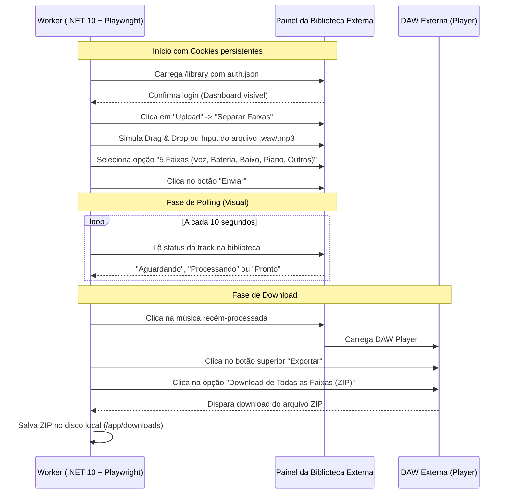

# Estudo de Viabilidade Técnica: Bot Extrator Headless de Stems (.NET 10 + Docker)

Este documento foi atualizado para focar **exclusivamente no desenvolvimento de um Bot de Simulação de Usuário Real** rodando de forma headless em **.NET 10** e **Docker (Linux VPS)**. A opção de API oficial foi totalmente descartada, priorizando o comportamento emulador sobre a interface Web da plataforma parceira de inteligência artificial de stems.

---

## 1. Visão Geral do Bot

O objetivo é criar uma aplicação C# autônoma (Worker Service) que se comporta exatamente como um produtor musical operando a plataforma externa de processamento de áudio em um navegador convencional. O bot receberá um arquivo de áudio local, fará o upload dele, esperará o processamento visualmente na biblioteca e, por fim, fará o download do pacote ZIP de stems da mesma forma que um humano faria na DAW online.

```
[Áudio Local] ──> ( Fila C# ) ──> [ Playwright (.NET 10) ]
                                          │  (Simula cliques, esperas e uploads)
                                          ▼
                                   [ Interface Web Externa ] ──> [ ZIP Baixado ]
```

---

## 2. Princípios de Simulação de Usuário Real (Anti-Detecção)

Para evitar que a plataforma externa de processamento identifique o bot como automação (o que levaria ao bloqueio da conta ou à ativação de CAPTCHAs de proteção), a aplicação implementará **quatro pilares de simulação humana**:

### A. Persistência e Exportação de Sessão (Zero Logins na VPS)
* **O Risco:** Digitar usuário e senha repetidamente a partir de um IP de VPS Linux (ex: DigitalOcean, AWS, Hetzner) ativará imediatamente o sistema antifraude e os desafios do Cloudflare de proteção.
* **A Solução:** O login inicial será feito de forma manual em seu computador pessoal (IP residencial confiável) em uma janela visível (`Headless = false`). O Playwright extrairá os cookies, tokens JWT e estados de `localStorage` em um arquivo `auth.json`. 
* **O Bot:** Na VPS, o bot inicializa o navegador diretamente carregando o `auth.json`. O site de processamento externo abrirá **instantaneamente logado**, sem passar pela tela de login nem disparar alertas de "novo acesso suspeito".

### B. Ocultação de Sinais de Automação (Stealth)
O Playwright padrão injeta algumas variáveis no Javascript do navegador que o denunciam como robô (ex: `navigator.webdriver = true`). Modificaremos as propriedades de lançamento do Chromium no C# para omitir estes sinais:
* Desativar a flag `AutomationControlled`.
* Definir uma resolução de tela padrão de desktop realista (ex: `1366x768` ou `1920x1080`).
* Injetar um `User-Agent` de navegador comum de mercado (ex: Chrome recente rodando em Windows 11).
* Configurar idiomas aceitos no header (`pt-BR`, `pt`, `en-US`).

### C. Ações Humanizadas (Human-like Typing & Clicks)
* **Cliques com Delays Aleatórios:** Em vez de clicar instantaneamente em uma sequência de botões em milissegundos, o bot aplicará pequenos tempos de espera aleatórios (`Random.Shared.Next(800, 2200)` ms) entre as interações.
* **Digitação Cadenciada:** Se o bot precisar preencher algum campo de texto, cada caractere será digitado com um intervalo de tempo variável (de 50ms a 150ms por caractere).

---

## 3. O Fluxo de Navegação Automatizado (Passo a Passo)

Abaixo está o mapeamento exato de como o robô interagirá com a interface externa:



---

## 4. Estrutura de Código Recomendada (.NET 10)

Para manter o serviço 100% resiliente a falhas temporárias na rede ou travamentos do navegador, estruturaremos a automação com tratamento rígido de exceções e reinicialização automática do contexto do navegador.

### Script do Bot Simulador (`ExtractorBotService.cs`)

```csharp
using Microsoft.Playwright;
using System;
using System.IO;
using System.Threading;
using System.Threading.Tasks;

namespace Mixer8Extractor.Bot;

public class ExtractorBotService
{
    private readonly string _storageStatePath = Path.Combine(AppDomain.CurrentDomain.BaseDirectory, "config", "auth.json");
    private readonly string _downloadDirectory = "/app/downloads";

    public async Task ProcessarExtracaoAsync(string audioPath, CancellationToken cancellationToken)
    {
        // 1. Inicializa o Playwright
        using var playwright = await Playwright.CreateAsync();
        
        // Configurações críticas para simular navegador de usuário comum e rodar liso no Docker Linux
        var launchOptions = new BrowserTypeLaunchOptions
        {
            Headless = true,
            Args = new[] 
            { 
                "--no-sandbox", 
                "--disable-setuid-sandbox", 
                "--disable-dev-shm-usage",
                "--disable-web-security",
                "--disable-blink-features=AutomationControlled", // Remove flag de bot
                "--use-gl=angle", 
                "--use-angle=swiftshader"
            }
        };

        await using var browser = await playwright.Chromium.LaunchAsync(launchOptions);
        
        // 2. Injeta estado de autenticação e cria contexto com resolução realista
        var contextOptions = new BrowserNewContextOptions
        {
            UserAgent = "Mozilla/5.0 (Windows NT 10.0; Win64; x64) AppleWebKit/537.36 (KHTML, like Gecko) Chrome/120.0.0.0 Safari/537.36",
            ViewportSize = new ViewportSize { Width = 1280, Height = 800 },
            Locale = "pt-BR",
            TimezoneId = "America/Sao_Paulo"
        };

        if (File.Exists(_storageStatePath))
        {
            contextOptions.StorageStatePath = _storageStatePath;
        }
        else
        {
            throw new InvalidOperationException($"[BOT ERROR] Arquivo de sessão auth.json não encontrado em: {_storageStatePath}. É necessário fazer o login manual inicial para gerar este arquivo.");
        }

        var context = await browser.NewContextAsync(contextOptions);
        var page = await context.NewPageAsync();

        // 3. Acessar Biblioteca Externa
        Console.WriteLine("[BOT] Acessando biblioteca da plataforma externa...");
        await page.GotoAsync("https://studio.external-stems-ai.com/library", new PageGotoOptions { Timeout = 60000 });
        
        // Pequena espera humana
        await Task.Delay(Random.Shared.Next(1500, 3000), cancellationToken);

        // Validar se o cookie está funcionando ou se fomos jogados na tela de login
        if (page.Url.Contains("/login"))
        {
            throw new UnauthorizedAccessException("[BOT ERROR] Sessão expirou ou o arquivo auth.json é inválido/antigo. Faça o login manual novamente.");
        }

        Console.WriteLine("[BOT] Autenticado com sucesso via cookies persistentes!");

        // 4. Iniciar processo de upload
        Console.WriteLine("[BOT] Iniciando fluxo de upload...");
        await page.ClickAsync("button:has-text('Upload')", new PageClickOptions { Timeout = 15000 });
        await Task.Delay(Random.Shared.Next(800, 1500), cancellationToken);

        // Clica na opção de separação de faixas (Track Separation)
        await page.ClickAsync("text=Track Separation");
        await Task.Delay(Random.Shared.Next(1000, 2000), cancellationToken);

        // Selecionar arquivo
        var fileChooser = await page.RunAndWaitForFileChooserAsync(async () =>
        {
            // Clica na área de upload / drag and drop
            await page.ClickAsync(".upload-drop-zone"); // Seletor fictício para o container de upload
        });
        
        Console.WriteLine($"[BOT] Enviando arquivo de áudio: {Path.GetFileName(audioPath)}");
        await fileChooser.SetFilesAsync(audioPath);
        
        // Aguarda carregar o arquivo
        await Task.Delay(Random.Shared.Next(3000, 5000), cancellationToken);

        // Seleciona o rádio button de 5 Stems (Voz, Baixo, Bateria, Teclado, Outros)
        // Usamos um seletor amigável ao texto para maior estabilidade contra mudanças de layout
        await page.ClickAsync("label:has-text('5 stems')");
        await Task.Delay(Random.Shared.Next(800, 1500), cancellationToken);

        // Clica em Enviar/Processar
        await page.ClickAsync("button:has-text('Submit')");
        Console.WriteLine("[BOT] Formulário enviado! Aguardando o término do upload de rede...");
        
        // Espera o upload terminar observando o retorno para a biblioteca principal
        await page.WaitForURLAsync("**/library", new PageWaitForURLOptions { Timeout = 120000 });
        Console.WriteLine("[BOT] Upload concluído com sucesso. Iniciando monitoramento da fila de separação...");

        // 5. Polling visual de processamento na Biblioteca
        bool processado = false;
        int tentativasMaximas = 90; // Até 15 minutos (90 * 10s)
        string nomeArquivoSemExt = Path.GetFileNameWithoutExtension(audioPath);

        while (!processado && tentativasMaximas > 0)
        {
            tentativasMaximas--;
            await Task.Delay(10000, cancellationToken); // Polling a cada 10 segundos

            // Localiza a linha/card do áudio na lista
            var trackCard = page.Locator($".track-item:has-text('{nomeArquivoSemExt}')").First;
            
            if (await trackCard.CountAsync() > 0)
            {
                var textoStatus = await trackCard.InnerTextAsync();
                
                if (textoStatus.Contains("Pronto") || textoStatus.Contains("Ready") || textoStatus.Contains("Play"))
                {
                    processado = true;
                    Console.WriteLine("[BOT] Status: Áudio processado e pronto para extração!");
                }
                else
                {
                    Console.WriteLine($"[BOT] Status: Ainda processando stems... (Tentativas restantes: {tentativasMaximas})");
                }
            }
            else
            {
                // Tenta recarregar a página caso a lista de áudios novos não apareça instantaneamente
                Console.WriteLine("[BOT] Áudio ainda não apareceu na lista, atualizando página...");
                await page.ReloadAsync();
            }
        }

        if (!processado)
        {
            throw new TimeoutException("[BOT ERROR] O processamento do áudio demorou mais que o esperado (limite de 15 min).");
        }

        // 6. Abrir a DAW / Player e Baixar Stems
        Console.WriteLine("[BOT] Acessando o player da faixa...");
        await page.ClickAsync($".track-item:has-text('{nomeArquivoSemExt}')");
        
        // Aguarda a DAW (Player) estar totalmente carregada
        await page.WaitForSelectorAsync(".daw-container, .player-interface", new PageWaitForSelectorOptions { Timeout = 30000 });
        await Task.Delay(Random.Shared.Next(2000, 4000), cancellationToken);

        // Clica no botão Exportar/Baixar
        Console.WriteLine("[BOT] Abrindo menu de exportação...");
        await page.ClickAsync("button:has-text('Export')");
        await Task.Delay(Random.Shared.Next(800, 1500), cancellationToken);

        // Clica para baixar todas as faixas agrupadas em ZIP
        Console.WriteLine("[BOT] Solicitando download do ZIP de todas as faixas...");
        
        // Intercepta o evento de download nativo do browser para podermos salvar onde quisermos
        var download = await page.RunAndWaitForDownloadAsync(async () =>
        {
            await page.ClickAsync("text=All Tracks (ZIP)");
        });

        // Salvar ZIP no diretório correto dentro do container
        string pathDestinoZip = Path.Combine(_downloadDirectory, $"{nomeArquivoSemExt}_stems.zip");
        await download.SaveAsAsync(pathDestinoZip);

        Console.WriteLine($"[BOT SUCCESS] Download concluído! Arquivo ZIP salvo com sucesso em: {pathDestinoZip}");
    }
}
```

---

## 5. Arquitetura Dockerizada (.NET 10 + Playwright + Linux VPS)

O bot rodará em uma VPS Linux comum empacotado em um container Docker. Para que o navegador Chromium consiga ser executado com alta performance e sem travar, precisamos configurar corretamente o Dockerfile e o docker-compose.yml.

### 5.1. Dockerfile Otimizado

```dockerfile
# ==========================================
# Fase 1: Compilação (.NET 10 SDK)
# ==========================================
FROM mcr.microsoft.com/dotnet/sdk:10.0 AS build
WORKDIR /src

COPY ["Mixer8.Extractor.csproj", "./"]
RUN dotnet restore "./Mixer8.Extractor.csproj"

COPY . .
RUN dotnet publish "Mixer8.Extractor.csproj" -c Release -o /app/publish /p:UseAppHost=false

# ==========================================
# Fase 2: Execução (.NET 10 Runtime + Chromium)
# ==========================================
FROM mcr.microsoft.com/dotnet/runtime:10.0 AS final
WORKDIR /app
COPY --from=build /app/publish .

# Instalação das dependências necessárias para o Chromium Headless rodar no Linux
RUN apt-get update && apt-get install -y \
    wget \
    gnupg \
    libnss3 \
    libnspr4 \
    libatk1.0-0 \
    libatk-bridge2.0-0 \
    libcups2 \
    libdrm2 \
    libxkbcommon0 \
    libxcomposite1 \
    libxdamage1 \
    libxext6 \
    libxfixes3 \
    librandr2 \
    libgbm1 \
    libasound2 \
    libpango-1.0-0 \
    libcairo2 \
    fonts-liberation \
    --no-install-recommends && \
    rm -rf /var/lib/apt/lists/*

# Instala a ferramenta CLI do Playwright e instala o Chromium
ENV PLAYWRIGHT_BROWSERS_PATH=/app/pw-browsers
RUN dotnet tool install --global Microsoft.Playwright.CLI
ENV PATH="$PATH:/root/.dotnet/tools"
RUN playwright install chromium

# Configuração de volumes para manter os cookies (config) e salvar os arquivos baixados (downloads)
VOLUME [ "/app/config", "/app/downloads" ]

ENTRYPOINT ["dotnet", "Mixer8.Extractor.dll"]
```

### 5.2. Docker Compose (`docker-compose.yml`)

O Docker Compose garante que o container tenha acesso aos diretórios locais do seu servidor Linux VPS para persistir a autenticação e disponibilizar os arquivos `.zip` resultantes.

```yaml
version: '3.8'

services:
  mixer8-extractor:
    image: mixer8-extractor:latest
    build:
      context: .
      dockerfile: Dockerfile
    container_name: mixer8_extractor
    restart: unless-stopped
    volumes:
      # Pasta local na VPS onde os arquivos baixados serão disponibilizados
      - ./downloads:/app/downloads
      # Pasta onde o arquivo auth.json (cookies de login) ficará persistido
      - ./config:/app/config
    environment:
      - DOTNET_ENVIRONMENT=Production
```

---

## 6. Desafios do Modelo "Simulação de Usuário" e Como Superá-los

Rodar um robô simulado em plataforma de terceiros exige atenção a cenários do "mundo real":

### 1. Expiração do arquivo `auth.json` (Cookies)
* **Comportamento:** Eventualmente (geralmente entre 30 e 90 dias), a sessão na plataforma parceira expira por segurança. O bot tentará acessar a biblioteca, será redirecionado para a tela de login e falhará.
* **Superação:** O bot deve monitorar se foi jogado para a rota `/login`. Caso ocorra, ele deve parar o processamento atual e disparar um alerta visual ou notificação (via bot do Telegram/Discord ou log chamativo) para que você execute um script utilitário local (`dotnet run --mode=login`), faça o login na interface visual na sua máquina e o app salve o novo `auth.json` atualizado na VPS.

### 2. Mudança de Design do Site (DOM Selectors)
* **Comportamento:** Como é uma plataforma moderna, o layout externo muda com o tempo. Um botão de "Exportar" que hoje tem um texto pode passar a ser um ícone.
* **Superação:** O projeto deve utilizar seletores altamente semânticos (ex: localizar elementos por seu papel de acessibilidade, tags ARIA ou texto exato ao invés de classes CSS geradas dinamicamente). Adicionalmente, o código deve ser extremamente modularizado para que, se um botão mudar, apenas uma linha de seletor precise ser alterada no arquivo de configuração do robô.

---

## 7. Próximos Passos para o Desenvolvimento do Bot

Caso o plano seja avançar com este bot extractor, propomos as seguintes etapas sequenciais para a PoC (Prova de Conceito):

1. **Setup do Projeto C#:** Iniciar um projeto do tipo Worker Service em .NET 10.
2. **Script Utilitário de Captura de Sessão (`LoginHelper`):** Criar um pequeno fluxo interativo que abre o navegador com interface gráfica (`Headless = false`), permite você digitar suas credenciais e, ao detectar que a biblioteca carregou, salva o estado atual em `auth.json`.
3. **Desenvolvimento do Fluxo Core:** Codificar as etapas de cliques para upload, espera de fila visualmente e extração de download.
4. **Validação Docker:** Montar o Dockerfile e subir em um container local para confirmar que o Chromium headless do Linux VPS consegue interagir exatamente como o Windows.
